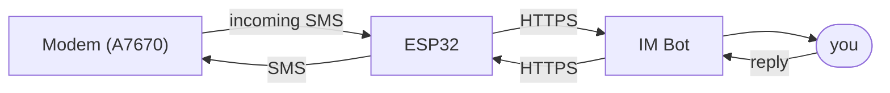

# RFC-0001 — Rust Rewrite Foundation
## smsgate — Scope, Architecture & Constraints

**Status**: Accepted | **Branch**: rust-rewrite

---

## 1. Purpose

This document defines the scope, architecture, and constraints of the Rust rewrite.
It is the authoritative reference for what the new codebase does and does not do.

---

## 2. Problems with the Existing C++ Firmware

The C++ implementation works and has been systematically hardened (RFC-0266 through RFC-0275),
but has accumulated structural debt:

| Problem | Root cause |
|---------|-----------|
| 275+ features, 97 bot commands | No scope constraint; every idea became a commit |
| `telegram_poller.cpp` is 4600 lines in a single file | No command abstraction; all logic piled together |
| 14 `millis()` wraparound bugs found | C++ does not enforce safe timer arithmetic |
| `DynamicJsonDocument` sizing bug | Manual size estimation; silent truncation on overflow |
| Signed overflow UB in timer arithmetic | C++ permits this; the compiler exploits it for optimisation |
| Hard to test | Arduino `String` leaks into business logic; test boundaries are unclear |
| Hard to understand | Feature count turns reading the code into a research project |

The Rust rewrite addresses all of the above — but only if we **stay ruthlessly minimal**.
**A small codebase is more reliable than a large hardened one.**

---

## 3. What This Tool Is

A **personal SMS relay**, serving one user, running on one device.



That is the complete product. Everything else is decoration.

---

## 4. Scope — What We Build

### 4.1 Core Data Flows (non-negotiable)

| Flow | Description |
|------|-------------|
| **SMS → IM** | Receive `+CMTI` URC, decode PDU (GSM-7 / UCS-2 / concatenated SMS), forward to IM with sender and timestamp |
| **IM → SMS** | User replies to a forwarded message; the bridge sends the reply as a PDU SMS |
| **Incoming call notification** | Detect `RING` + `+CLIP`, send notification, auto-hang-up |
| **Send queue** | Outbound SMS queue with up to 3 retries, exponential backoff (2 s / 8 s / 30 s) |

### 4.2 Bot Commands (exactly these, no more)

| Command | Purpose |
|---------|---------|
| `/help` | List all commands |
| `/status` | Uptime, signal strength, heap, last SMS time, queue depth |
| `/send <number> <text>` | Send an SMS immediately |
| `/log [N]` | Last N forwarded messages (default 10) |
| `/queue` | Inspect the outbound queue |
| `/block <number>` | Add to blocklist |
| `/unblock <number>` | Remove from blocklist |
| `/pause [minutes]` | Pause forwarding (default 60 min) |
| `/resume` | Resume forwarding immediately |
| `/restart` | Reboot the device |

**10 commands, hard cap. Adding one requires removing one, or raising the cap with
a documented justification committed to this file.**

### 4.3 Persistence (NVS)

| Key | Type | Purpose |
|-----|------|---------|
| `im_cursor` | i64 | IM poll cursor (value of `since` on next `poll` call) |
| `reply_map` | blob | Ring buffer of (MessageId → phone number), 100 slots |
| `block_list` | blob | Blocked phone numbers |
| `fwd_enabled` | bool | Forwarding pause state |

Nothing else is persisted. Configuration (WiFi credentials, bot token, pin numbers, etc.)
lives in a compile-time `config.toml`, injected as constants by `build.rs`,
completely separate from NVS. See §6.9.

### 4.4 Observability

- **Structured serial logs**: every significant event via `log::info!` / `log::warn!` / `log::error!`,
  format `[subsystem] message`.
- **`/status` command**: runtime health dashboard.
- **`/log` command**: recent SMS history (ring buffer, 50 entries, in-memory only).
- **Hardware watchdog**: 120 s timeout, kicked in the main loop.
- **Low-heap alert**: send an IM alert when heap falls below 20 KB.

---

## 5. Scope — What We Do Not Build

The following features exist in the C++ firmware and **will not be ported**.
Every exclusion is deliberate.

| Excluded feature | Reason |
|-----------------|--------|
| Scheduled SMS (5 variants) | Use Telegram's built-in scheduled messages instead |
| Phone number aliases | Adds state; rarely used; phone numbers are already readable |
| USSD commands | Rarely needed; use a serial terminal when required |
| AT passthrough | Security attack surface; use the serial console when needed |
| Auto-reply templates | Adds state-machine complexity; not a core feature |
| Multicast send | Rarely used; loop `/send` in the IM client instead |
| Per-number do-not-disturb | A workflow problem, not a technical one |
| SMS delivery reports | Can be added later if needed; deferred |
| Multi-user forwarding | Single-user tool; can be added later if needed |
| Heartbeat with balance query | Balance queries are carrier-dependent; `/status` is enough |
| CSV log export | Over-engineered; `/log` is sufficient |
| WiFi scan | Use the router admin page |
| Diagnostic dump commands (`/heap`, `/ip`, `/modeminfo`, `/simlist`, …) | `/status` covers key info; the rest is available via serial console |
| Alert muting | Fix the root cause of excessive alerts rather than masking them |
| Persisting every parameter | Fewer knobs; defaults should be good |

**If a feature is not in §4, it must not be added without a documented reason committed to this file.**

---

## 6. Architecture

### 6.1 Module Layout

**Rule: trait definitions go in the parent `mod.rs`; small implementations are single files,
large implementations get a subdirectory.**

```
src/
  main.rs                  — composition root; wires subsystems together
  config.rs                — compile-time config (env!() references only, no literals)

  boards/
    mod.rs                 — Board trait + ModemVariant enum
    ta7670x.rs             — T-A7670X board impl (pin layout + power-on sequence)

  modem/
    mod.rs                 — ModemPort trait + AtResponse + ModemError
    a76xx/                 — A7670/A7608 driver (large, split into submodules)
      mod.rs               — A76xxModem struct + ModemPort impl (composition root)
      at.rs                — raw AT send/receive + response line parser
      urc.rs               — URC parser (+CMTI / RING / +CLIP / +CMT, etc.)
      sms.rs               — PDU send + read + delete (AT+CMGS flow)

  im/
    mod.rs                 — Messenger trait + InboundMessage + MessageId + MessengerError
    telegram/              — Telegram backend (medium size, split into submodules)
      mod.rs               — TelegramMessenger struct + Messenger impl
      http.rs              — raw HTTPS request/response layer over EspTls
      types.rs             — Update / Message JSON deserialisation types
    // future: signal/, whatsapp/, each in its own subdirectory

  sms/
    mod.rs                 — shared types (SmsMessage + SmsError)
    codec.rs               — PDU encode/decode (pure functions, no_std compatible)
    concat.rs              — concatenated SMS reassembly
    sender.rs              — outbound queue + retry scheduler

  bridge/
    forwarder.rs           — SMS → IM notification core logic
    call_handler.rs        — RING/CLIP state machine
    poller.rs              — IM message poll loop
    reply_router.rs        — MessageId → phone number mapping

  commands/
    mod.rs                 — Command trait + CommandRegistry
    builtin/               — built-in commands (add a command = add a file)
      mod.rs               — re-exports all built-in commands
      help.rs              — /help
      status.rs            — /status
      send.rs              — /send
      log.rs               — /log
      queue.rs             — /queue
      block.rs             — /block + /unblock (semantically related, one file)
      pause.rs             — /pause + /resume (semantically related, one file)
      restart.rs           — /restart

  persist/
    mod.rs                 — Store trait + StoreError
    nvs.rs                 — ESP32 NVS implementation
    mem.rs                 — in-memory implementation (for tests)

  log_ring.rs              — fixed-size SMS history ring buffer (heapless::Deque)

config.toml.example        — configuration template (committed to git)
config.toml                — user configuration (gitignored, never committed)
build.rs                   — reads config.toml at compile time, injects constants
```

### 6.2 Core Traits

These are the seams that make the system testable and extensible.
Every subsystem depends only on traits, never on concrete types.

```rust
/// Abstracts the modem's serial port and AT command interface.
pub trait ModemPort {
    /// Send an AT command suffix (without the "AT" prefix); return the response.
    fn send_at(&mut self, cmd: &str) -> Result<AtResponse, ModemError>;
    /// Non-blocking poll: return a complete URC line if one is available.
    fn poll_urc(&mut self) -> Option<String>;
    /// Send an SMS in PDU mode; return the message reference number (MR) on success.
    fn send_pdu_sms(&mut self, hex: &str, tpdu_len: u8) -> Result<u8, ModemError>;
    /// Hang up the current call.
    fn hang_up(&mut self) -> Result<(), ModemError>;
}

/// Opaque handle to a previously sent message.
/// Used by reply routing to correlate IM replies back to a phone number.
pub type MessageId = i64;

/// A message received from the IM backend (command or reply).
pub struct InboundMessage {
    /// Monotonically increasing cursor; pass as `since` on the next poll.
    pub cursor: i64,
    /// Message text (starts with "/" for commands).
    pub text: String,
    /// If this is a reply to a previously sent message, its ID.
    pub reply_to: Option<MessageId>,
}

/// Abstracts any IM backend capable of sending and receiving text messages.
///
/// Implementing this trait = supporting a new IM app.
/// All business logic in bridge/, commands/, etc. depends only on this trait
/// and knows nothing about Telegram, Signal, or any other backend.
pub trait Messenger {
    /// Send a text message to the admin; return the sent message's ID.
    fn send_message(&mut self, text: &str) -> Result<MessageId, MessengerError>;
    /// Poll for new messages. `since` is the cursor from the last poll (0 on first call).
    /// `timeout_sec = 0` means return immediately (short poll).
    fn poll(
        &mut self,
        since: i64,
        timeout_sec: u32,
    ) -> Result<Vec<InboundMessage>, MessengerError>;
}

/// Abstracts key-value persistence (NVS on device; in-memory in tests).
pub trait Store {
    fn load(&self, key: &str) -> Option<heapless::Vec<u8, 8192>>;
    fn save(&mut self, key: &str, data: &[u8]) -> Result<(), StoreError>;
    fn delete(&mut self, key: &str) -> Result<(), StoreError>;
    fn clear_all(&mut self) -> Result<(), StoreError>;
}

/// Shared context available to a command handler.
/// Read-only views of all subsystems; no mutable references allowed.
pub struct CommandContext<'a> {
    pub store:        &'a dyn Store,
    pub modem_status: &'a ModemStatus,  // signal strength, operator, etc.
    pub log_ring:     &'a LogRing,
    pub send_queue:   &'a SendQueue,
    pub uptime_ms:    u32,
}

/// A single bot command.
pub trait Command: Send + Sync {
    fn name(&self) -> &'static str;
    fn description(&self) -> &'static str;
    /// Execute the command. `args` is the text after the command name.
    /// The return value is sent directly as the reply.
    fn handle(&self, args: &str, ctx: &CommandContext) -> String;
}
```

### 6.3 Adding a New IM Backend

1. Create a subdirectory under `src/im/`, e.g. `src/im/signal/`.
2. Implement the `Messenger` trait (`send_message` + `poll`).
3. Add a corresponding feature in `Cargo.toml` (`im-signal`).
4. Add a config section in `config.toml` (`[signal]`).
5. In `main.rs`, select which backend to instantiate based on the feature flag.

**No code in `bridge/`, `commands/`, or `persist/` needs to change.**
`MessageId` has consistent semantics across backends ("opaque handle to a sent message");
a new backend only needs to populate `reply_to` correctly in `poll()`.

### 6.4 Command Registry

Adding a command requires only implementing the `Command` trait and calling
`registry.register(Box::new(MyCommand))`. Routing, help text, and backend command
registration (e.g. Telegram `setMyCommands`) are all derived automatically from the registry.
**No changes to `poller.rs` or any other file.**

```rust
pub struct CommandRegistry {
    commands: Vec<Box<dyn Command>>,
}

impl CommandRegistry {
    pub fn register(&mut self, cmd: Box<dyn Command>) { ... }
    pub fn dispatch(&self, text: &str, ctx: &CommandContext) -> Option<String> { ... }
    pub fn help_text(&self) -> String { ... }
    pub fn command_list(&self) -> Vec<(&str, &str)> { ... }
}
```

### 6.5 SMS Processing Pipeline (extension point)

Incoming SMS messages pass through a small middleware chain before forwarding.
Each step has type `(SmsMessage) -> Option<SmsMessage>` — returning `None` drops the message.

```rust
pub type SmsFilter = Box<dyn Fn(&SmsMessage) -> Option<SmsMessage> + Send + Sync>;

pub struct SmsProcessor {
    filters: Vec<SmsFilter>,
}
```

Built-in filters: blocklist check, duplicate suppression.
Adding a filter (e.g. keyword alert, format transform) requires a single `push()` call in `main.rs`.

### 6.6 Error Handling

- Library code uses **`thiserror`** for typed errors (`ModemError`, `MessengerError`, etc.).
- `main.rs` and glue code uses **`anyhow`** to propagate mixed error types.
- Every error **must be logged** before being discarded; silent failures are not allowed.
- The panic handler logs the reason when the watchdog fires.

### 6.7 Timer Arithmetic

**No raw `>=` / `<` comparisons on timestamps.** Use exactly these two primitives:

```rust
/// Milliseconds elapsed since `snapshot` (safe across u32 wraparound).
fn elapsed_since(snapshot: u32, now: u32) -> u32 {
    now.wrapping_sub(snapshot)
}

/// Returns true when now >= target (within half a cycle).
fn is_past(target: u32, now: u32) -> bool {
    now.wrapping_sub(target) < u32::MAX / 2
}
```

All timer logic uses only these two functions.
This eliminates at the language level the entire class of wraparound bugs
found in the C++ implementation.

### 6.8 Memory Strategy

| Data | Strategy | Reason |
|------|----------|--------|
| SMS history log | `heapless::Deque<LogEntry, 50>` | Fixed stack allocation; no fragmentation |
| Reply target map | `[Option<(MessageId, heapless::String<20>)>; 100]` | Fixed size; indexed by `msg_id % 100` |
| Blocklist | `heapless::Vec<heapless::String<20>, 20>` | Small and sufficient; 20 numbers |
| Concat SMS groups | `heapless::Vec<ConcatGroup, 8>` | At most 8 in-progress groups |
| Command output | `alloc::String` | Short-lived; freed after send |
| PDU buffer | stack-allocated `[u8; 280]` | PDU max 280 bytes |

No dynamic allocation on the hot path.
`alloc::String` is used only for IM message bodies (short-lived, low frequency).

### 6.9 Configuration Design

**Goal**: zero secrets in the repository; anyone who forks only needs to fill in one file.

#### Approach: compile-time `config.toml` + `build.rs` codegen

```
config.toml.example   ← committed to git (template, no real values)
config.toml           ← gitignored (filled in by the user, never committed)
build.rs              ← reads config.toml, injects constants via cargo:rustc-env
src/config.rs         ← env!() references only, no hardcoded values
```

`config.toml.example`:

```toml
[wifi]
ssid     = "YOUR_WIFI_SSID"
password = "YOUR_WIFI_PASSWORD"

[im]
backend   = "telegram"       # only supported value for now; "signal" etc. in future
bot_token = "123456:ABCDEF..."
chat_id   = 987654321        # admin numeric chat ID

[modem]
# Default pins for LilyGo T-A7670X — change here when switching boards
uart_tx   = 26
uart_rx   = 27
uart_baud = 115200
pwrkey    = 4

[bridge]
max_failures_before_reboot = 8
poll_interval_ms           = 3000
watchdog_timeout_sec       = 120
```

`src/config.rs` contains only constants injected by `build.rs` at compile time:

```rust
pub struct Config;

impl Config {
    pub const WIFI_SSID:        &'static str = env!("CFG_WIFI_SSID");
    pub const WIFI_PASSWORD:    &'static str = env!("CFG_WIFI_PASSWORD");
    pub const IM_BACKEND:       &'static str = env!("CFG_IM_BACKEND");
    pub const BOT_TOKEN:        &'static str = env!("CFG_IM_BOT_TOKEN");
    pub const CHAT_ID:          i64          = /* generated by build.rs */;
    pub const UART_TX:          u8           = /* generated by build.rs */;
    pub const UART_RX:          u8           = /* generated by build.rs */;
    pub const UART_BAUD:        u32          = /* generated by build.rs */;
    pub const PWRKEY_PIN:       u8           = /* generated by build.rs */;
    pub const MAX_FAILURES:     u8           = /* generated by build.rs */;
    pub const POLL_INTERVAL_MS: u32          = /* generated by build.rs */;
    pub const WATCHDOG_TIMEOUT: u32          = /* generated by build.rs */;
}
```

**No literal WiFi passwords, bot tokens, or pin numbers anywhere outside `config.toml`.**
All pins and behavioural parameters come from `Config` so switching boards
requires only editing `config.toml`, not source code.

#### Open-source release checklist

- `config.toml` in `.gitignore` (already present)
- All values in `config.toml.example` are placeholders
- `build.rs` emits a clear compile error when `config.toml` is missing, directing the user to copy the template
- The README "Quick Start" step 1 is "copy and fill in `config.toml`"

### 6.10 Hardware Abstraction Layer

**Goal**: switching boards requires adding one file; zero business logic changes.

#### `Board` trait

The `Board` trait encapsulates all board-specific pin layout and initialisation details.
It is used only during startup in `main.rs`. Once the `ModemPort` is instantiated,
every other subsystem interacts only with `ModemPort` and knows nothing about the board.

```rust
/// Encapsulates board-specific pin layout and initialisation sequence.
/// Implementing this trait = supporting a new board.
pub trait Board {
    /// Modem chip family (affects minor AT command set differences).
    fn modem_variant(&self) -> ModemVariant;

    /// AT UART TX pin number (ESP32 perspective).
    fn uart_tx_pin(&self) -> u8;
    /// AT UART RX pin number (ESP32 perspective).
    fn uart_rx_pin(&self) -> u8;
    /// UART baud rate.
    fn uart_baud(&self) -> u32;

    /// PWRKEY GPIO (drive high/low to power the modem on/off).
    fn pwrkey_pin(&self) -> u8;
    /// RESET GPIO (optional; None means no hardware reset line).
    fn reset_pin(&self) -> Option<u8>;

    /// Initialisation sequence: called first in `main.rs`.
    /// Configures GPIO modes, power rail timing, etc.
    fn init(&self, peripherals: &mut Peripherals) -> Result<(), BoardError>;

    /// Build a configured ModemPort instance.
    fn build_modem_port(
        &self,
        peripherals: &mut Peripherals,
    ) -> Result<Box<dyn ModemPort>, BoardError>;
}

pub enum ModemVariant {
    A76xx,   // A7670, A7608, A7672, etc.
    Sim76xx, // SIM7600, SIM7670, etc. (future)
}
```

`ta7670x.rs` implementation example (directory layout in §6.1):

```rust
pub struct TA7670X;

impl Board for TA7670X {
    fn modem_variant(&self) -> ModemVariant { ModemVariant::A76xx }
    fn uart_tx_pin(&self)   -> u8           { Config::UART_TX }
    fn uart_rx_pin(&self)   -> u8           { Config::UART_RX }
    fn uart_baud(&self)     -> u32          { Config::UART_BAUD }
    fn pwrkey_pin(&self)    -> u8           { Config::PWRKEY_PIN }
    fn reset_pin(&self)     -> Option<u8>   { None }

    fn init(&self, peripherals: &mut Peripherals) -> Result<(), BoardError> {
        // Configure PWRKEY as push-pull output, power-on sequence (100 ms low)
        Ok(())
    }

    fn build_modem_port(
        &self,
        peripherals: &mut Peripherals,
    ) -> Result<Box<dyn ModemPort>, BoardError> {
        // Initialise UART, return A76xxModem instance
        todo!()
    }
}
```

#### Adding a new board

1. Create `src/boards/<board>.rs`.
2. Implement the `Board` trait (usually just filling in the correct pins and power-on timing).
3. Conditionally export from `src/boards/mod.rs` with `#[cfg(feature = "board_<board>")]`.
4. Add the feature in `Cargo.toml`.
5. Set the board in `config.toml` (or pass `--features board_<board>` at build time).

**No business logic files need to change.**
`sms/`, `im/`, `bridge/`, and `commands/` know nothing about the specific board.

---

## 7. What Rust Gives Us

| C++ pain point | Rust solution |
|---------------|---------------|
| `millis()` wraparound (14 bugs found) | `wrapping_sub` is the only subtraction path on `u32`; no other route exists |
| Signed overflow UB | Panics in debug; requires explicit `wrapping_*` in release |
| `DynamicJsonDocument` sizing | `serde_json` allocates on demand; no size estimate needed |
| ArduinoJson silent truncation | `serde` parse failure returns `Err`; callers must handle it |
| `String` heap fragmentation | Fixed-size strings with `heapless::String`; `alloc::String` only for transient output |
| Hard to test | Traits as boundaries → swap real hardware for mocks in unit tests |
| 97 commands in one file | `Command` trait → each command is its own struct; registry auto-discovers them |

---

## 8. What Rust Costs

| Cost | Mitigation |
|------|-----------|
| No Rust equivalent of TinyGSM | Write a minimal AT driver (~400 lines); our required subset is small |
| No Rust port of WiFiClientSecure | Use `esp-idf-svc::tls::EspTls` (officially maintained by Espressif) |
| Longer compile times (~60–90 s) | Acceptable for a personal project |
| Xtensa Rust toolchain is unofficial | The `esp-rs` fork is high quality; maintained by Espressif employees |
| `heapless` collections have poor ergonomics | Worth it for predictable memory behaviour |

---

## 9. Migration Plan

The C++ `main` / `stable` branches remain live throughout the migration.
The Rust rewrite is developed on the `rust-rewrite` orphan branch.
**No big-bang cutover.**

### Phase 1 — Pure library (no hardware required)
Port `sms_codec.cpp` to `src/sms/codec.rs`.
Convert existing Unity tests to `#[test]`.
**Milestone**: PDU encode/decode at 100% test coverage before touching any hardware path.

### Phase 2 — Modem driver
Implement `ModemPort` for the A7670 using `esp-idf-hal::uart`.
Validate against real hardware serial captures and C++ output.
**Milestone**: receive a `+CMTI` URC and parse the SMS index.

### Phase 3 — IM client
Implement the `Messenger` trait using `esp-idf-svc::tls::EspTls` (Telegram first).
**Milestone**: `/status` command works end-to-end.

### Phase 4 — SMS forwarding bridge
Wire `SmsProcessor` + `Forwarder` + `poller`.
**Milestone**: SIM receives an SMS, it appears in IM; reply in IM, SMS is delivered.

### Phase 5 — Hardening and cutover
- All 10 commands implemented and tested.
- Blocklist and forwarding pause work correctly.
- Outbound queue retry logic works correctly.
- Run in parallel with the C++ version for one week, compare behaviour.
- Cut over; archive the `stable` branch.

---

## 10. Decision Log

| Decision | Rationale |
|----------|-----------|
| Single admin chat only | Personal tool; multi-user adds auth complexity with no benefit |
| No scheduled SMS | The scheduler was the single largest source of C++ complexity |
| No number aliases | Cognitive overhead exceeds convenience for a single user |
| 10-command hard cap | Enforced constraint; browsing 97 commands is not a UX |
| `heapless` on the hot path | Predictable memory; no fragmentation over 49-day runs |
| Single-threaded main loop | Simpler to reason about; no mutexes needed; same model as C++ |
| Traits at all I/O boundaries | Every subsystem can be host-tested without hardware |
| `wrapping_sub` only | Eliminates an entire class of bugs at the language level |
| `Messenger` trait instead of hard-coded `BotApi` | Switching IM backend = one new file; `bridge/` and `commands/` know nothing about Telegram |
| `MessageId` is an opaque `i64` | Consistent semantics across backends; format differences are encapsulated in each impl |
| Compile-time `config.toml` instead of runtime config | No filesystem on embedded; compile-time injection is ESP-IDF convention; NVS stores only runtime state |
| All pins and baud rates from `config.toml` | Zero source changes when switching boards; open-source users only need to fill in a config file |
| `Board` trait isolates board-specific details | Switching boards = one new file + trait impl; no business logic touched |
| Business logic knows nothing about `Board` | `ModemPort` is the only seam; `boards/` is only visible in `main.rs` at startup |

---

*This document is the single authoritative source for the scope of the Rust rewrite.
Changes to §4 or §5 must be committed to this file with a documented justification.*
