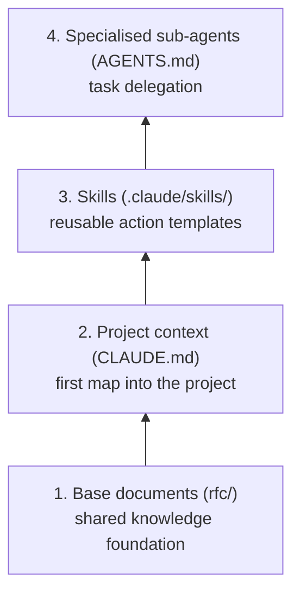
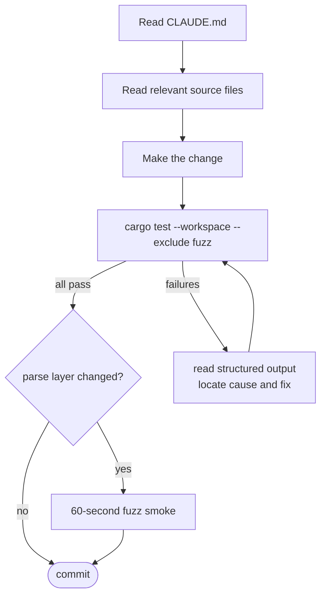

# RFC-0002 — Agent-Friendly Harness
## LilyGo SMS-IM Bridge — Agent Infrastructure Design

**Status**: Accepted | **Branch**: rust-rewrite

---

## 1. Purpose

This document describes the infrastructure that enables AI coding agents to contribute
to this project effectively. The goal is not merely "AI can run the code" but
"AI can operate like a developer who knows the project" — knowing where to find
information, having standard action templates to follow, being able to verify
changes autonomously, and not requiring human intervention to complete routine tasks.

---

## 2. Four-Layer Model



Each layer assumes the layers below it are in place. An agent reads `CLAUDE.md`
to understand the project; invokes a Skill to perform a standard operation;
delegates to a sub-agent when a task spans a specialised domain.

---

## 3. Layer 1 — Base Documents

Each document has a single clear responsibility and does not duplicate content
from any other document.

**Audience model**:
- `rfc/` — read by both humans and agents. Humans review and discuss; agents draft,
  modify, and implement based on them. An RFC is the shared source of truth for a design decision.
- `CLAUDE.md` — read by agents only. Operational directives: commands, recipes, invariants.
  No design rationale.
- `README.md` — read by humans only. Project introduction and navigation.

| File | Responsibility | Primary workflow |
|------|---------------|-----------------|
| `rfc/0001-foundation.md` | Architecture, scope, trait design, decision log | Humans review; agents implement against |
| `rfc/0002-agent-harness.md` | Agent infrastructure design (this document) | Humans plan; agents build the tooling |
| `CLAUDE.md` | Commands, recipes, invariants, forbidden patterns | Agents only — auto-loaded each session |
| `AGENTS.md` | Sub-agent definitions and responsibilities | Agents consult when delegating |
| `serial_capture/*.txt` | Real hardware AT conversation recordings | Agents write regression tests from these |

**Design principles**:
- One document, one responsibility — no cross-copying of content
- Cross-references use section numbers (e.g. "see rfc/0001-foundation.md §6.2"), not copy-paste
- Documents are committed in sync with code — changing an API means updating the RFC in the same commit

---

## 4. Layer 2 — CLAUDE.md

`CLAUDE.md` is the first file loaded when an agent enters the project.
Think of it as a day-one onboarding cheat sheet. Keep it short —
details live in the other documents; `CLAUDE.md` provides pointers and recipes only.

### Should contain

```
1. One-line project description
2. Branch orientation (main = C++ stable; rust-rewrite = this branch)
3. Key document index (pointers, no content duplication)
4. Common commands (test, build, flash, fuzz)
5. Task recipes (add a command, add a board, add a test scenario)
6. Key invariants (checklist of things to verify after any change)
7. Forbidden patterns (hardcoded secrets, raw >= timer comparisons,
   referencing a concrete IM backend in business logic, …)
```

### Should not contain

- Architecture details (those are in `rfc/0001-foundation.md`)
- Trait definitions (those are in `rfc/0001-foundation.md`)
- Agent infrastructure design (that is in this document)
- Sub-agent definitions (those are in `AGENTS.md`)

**Target length: 300 lines or fewer.** If it grows beyond that, content has been
placed in the wrong document.

---

## 5. Layer 3 — Skills

Skills are Markdown files under `.claude/skills/` that define action templates
invocable via `/skill-name`. Each Skill is a precise set of instructions for an
agent describing *how to complete a task*, including acceptance criteria.

### Planned skills

| Skill | Invocation | What it does |
|-------|-----------|-------------|
| `add-command` | `/add-command <name>` | Scaffold a new bot command (file, registration, test) |
| `add-board` | `/add-board <name>` | Scaffold a new board (file, feature flag, config template entry) |
| `scenario` | `/scenario <name>` | Scaffold a new end-to-end test scenario |
| `capture` | `/capture <description>` | Guide recording a serial AT conversation and normalising it to `serial_capture/*.txt` |
| `flash` | `/flash` | Build firmware and flash to the connected device, then monitor serial output |

### Skill file structure

Every Skill file must contain:
1. **Preconditions**: what must be true before running (e.g. command count < 10)
2. **Numbered steps**: an unambiguous ordered sequence of actions
3. **Acceptance criteria**: how to know the operation succeeded
4. **Failure handling**: common failure scenarios and how to handle them

Skill files **must not** contain the actual code to be written — that is generated
by the agent from context. Skills describe the *process*, not the *outcome*.

---

## 6. Layer 4 — Sub-agents (AGENTS.md)

`AGENTS.md` defines specialised sub-agents for tasks that fall clearly within
a single technical domain. The orchestrating agent delegates to sub-agents
rather than doing everything itself.

### Planned sub-agents

#### `firmware-agent`
**Expertise**: ESP32 / Xtensa toolchain, ESP-IDF HAL, embedded Rust constraints
**Typical tasks**: implement `Board` trait, debug cross-compilation errors, optimise flash/RAM usage
**Does not do**: business logic, test scenarios

#### `codec-agent`
**Expertise**: GSM-7 / UCS-2 / PDU encode-decode, concatenated SMS protocol (3GPP TS 23.040)
**Typical tasks**: implement/fix `sms/codec.rs`, add fuzz targets, analyse AT serial captures
**Does not do**: IM layer, persistence

#### `harness-agent`
**Expertise**: test infrastructure, Mock design, Scenario DSL, `proptest` property tests
**Typical tasks**: add test scenarios, extend `ScriptedModem`, reproduce fuzz crashes
**Does not do**: firmware features

#### `im-agent`
**Expertise**: Messenger trait design, Telegram Bot API, onboarding new IM backends
**Typical tasks**: implement a new IM backend, debug `im/telegram/http.rs`, handle API version changes
**Does not do**: modem layer

### Sub-agent operating principles

- The orchestrating agent is responsible for task decomposition and result integration
- Sub-agents do not share context — the orchestrator must provide sufficient background in the delegation prompt
- Every sub-agent run ends with `cargo test --workspace`; the result is reported back to the orchestrator

---

## 7. Verification Layer — Test Infrastructure

Agents need to verify their changes autonomously without human involvement.
The following tooling is designed for this purpose.
(Implementation details are filled in as development progresses.)

### Host-runnable full test suite

All business logic tests run on x86 host, no hardware required.
`cargo test --workspace --exclude fuzz` is the primary verification command for agents;
it should complete in under 5 seconds with a clear pass/fail result.

### Mock layer

Every external boundary has a Mock implementation, letting agents inject arbitrary
inputs and assert on outputs:

- **`ScriptedModem`**: programmable AT response script; unconsumed script steps fail the test
- **`RecordingMessenger`**: captures all sent IM messages; supports injecting inbound messages
- **`FakeClock`**: full control over time; no real waiting for timer expiry
- **`MemStore`**: in-memory NVS; each test case gets a fresh independent instance

### Scenario DSL

End-to-end interactions expressed as declarative scripts;
failures produce structured, agent-parseable output:

```rust
Scenario::new("SMS forward")
    .modem_urc("+CMTI: \"SM\",1")
    .modem_response("AT+CMGR=1", ...)
    .expect_im_sent(contains("+8613800138000"))
    .run();
```

Failures produce a structured diff, not a bare panic.

### Serial replay

Real hardware AT conversations are recorded as `serial_capture/*.txt` and committed to git.
`SerialReplay` converts them into `ScriptedModem` scripts for regression testing.
When a new bug is found on real hardware, record the session — the next agent run
has an automatic regression test.

### Fuzz targets

Pure function layers (PDU decode, URC parse, command parse) have fuzz targets.
Arbitrary input must not panic; only `Err` is allowed.
Agents modifying these modules run a 60-second smoke fuzz as an additional check.

---

## 8. Agent Standard Workflow



Agents do **not** need to: connect a development board, install the ESP-IDF toolchain
(unless changing `boards/` or `modem/`), read serial output, or understand the full AT command set.

---

## 9. Implementation Priority

| Priority | Deliverable | Depends on |
|----------|------------|-----------|
| P0 | `CLAUDE.md` (real file) | `rfc/0001-foundation.md` stable |
| P0 | `harness/` mock layer + Scenario DSL | Phase 1 code started |
| P1 | `AGENTS.md` (real file) | `CLAUDE.md` complete |
| P1 | `/add-command` skill | First command implemented |
| P2 | `/add-board` skill | `Board` trait implemented |
| P2 | `/scenario` skill | Scenario DSL complete |
| P3 | `/flash` and `/capture` skills | Hardware integration phase |

P0 items must be in place before the first line of firmware code is written.

---

*This document describes intent, not implementation.
Implementation progress is tracked in the git history of the respective files.*
